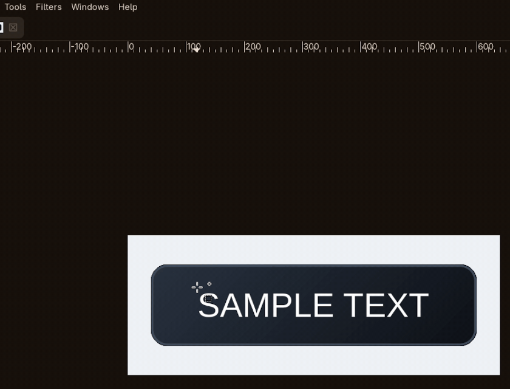

<div align="center">

# gimp-lama-cleanup

<br>

[English](../README.md) | Chinese

</div>

## 概述

一个 **GIMP 3** 插件，让你直接在画布里驱动
[lama-cleaner](https://github.com/Sanster/lama-cleaner) 服务。
圈出区域、运行插件，选区内的像素就被 LaMa 根据周围内容生成的结果替换 ——
选区外的像素**一个字节都不动**。

不需要"导出 → 上传 → 下载 → 贴回"的往返，画面其余部分也不会被重新编码。
它发出的请求与 lama-cleaner Web UI 上传的内容**逐像素等价**
（同样的像素、同样的 Alpha 通道、同样的参数），所以结果和浏览器里一致。

## 截图



上面这段录屏就是完整流程：拉一个选区，选
`Filters → Lama Cleanup → Quick Cleanup (last settings)`，只有选区里的像素被
替换 —— 不弹对话框、不新建图层、不经过文件来回倒腾。

| 处理前 —— 要去掉的文字 | 处理后 —— 只有选区被修复 |
|-----------------------------------|-------------------------------------|
|  |  |

## 特性

- **默认就地修改** —— 直接改当前图层；也提供非破坏性的 `New layer` 模式
- **只动选区** —— 服务端返回的内容按选区裁剪后贴入，其它地方不受影响
  （测试里逐像素核对过）
- **保留 Alpha 通道** —— 立绘切图、图标等带透明区的素材与 Web UI 行为一致
- **零额外依赖** —— 只用 GIMP 自带的 Python 3 + PyGObject，不需要
  `pip install`，不需要虚拟环境
- **参数与 Web UI 对齐** —— HD 策略、裁剪边距、触发尺寸、蒙版扩张/反相
- **不弹窗的 Quick Cleanup** —— 绑一个快捷键，流程就变成*圈选 → 按键*
- **无头测试套件** —— 蒙版几何、贴回对齐、Alpha 处理、错误路径、弹窗抑制，
  全部不需要图形界面

## 环境要求

- **GIMP 3.x** —— 开发与验证基于 3.2.6。**不支持 GIMP 2.10**（插件 API 完全不同）
- **Python 3 + PyGObject** —— 由 GIMP 自带，无需安装。实测 Flatpak 版内置 3.13
- **lama-cleaner 服务** —— 由你自己安装和运行，插件只负责连接。
  默认 `http://127.0.0.1:8080`，走普通 HTTP，放在另一台机器上也可以

## 快速开始

前置条件：装好 GIMP 3，并且你已经有**正在运行**的 lama-cleaner 服务，
在 `http://127.0.0.1:8080` 上能应答（放在别处也行 —— 插件有 **Server URL** 参数）。

GIMP 3 要求插件放在 `plug-ins/` 的**子目录**里；直接放在 `plug-ins/` 下的单个
`.py` 文件会被**静默跳过**。

```bash
git clone https://github.com/<you>/gimp-lama-cleanup.git
cd gimp-lama-cleanup

mkdir -p ~/.config/GIMP/3.2/plug-ins/lama-cleanup
install -m 0755 lama-cleanup.py \
    ~/.config/GIMP/3.2/plug-ins/lama-cleanup/lama-cleanup.py
```

上面是 Linux 的路径。通用形式是
`<配置根>/GIMP/<版本>/plug-ins/lama-cleanup/`，配置根取决于 GIMP 的安装方式：

| 安装方式 | 配置根 |
| --- | --- |
| Linux，发行版包 | `~/.config`（或 `$XDG_CONFIG_HOME`） |
| Linux，Flatpak | **同样是** `~/.config`，见下 |
| macOS | `~/Library/Application Support` |
| Windows | `%APPDATA%` |

**为什么 Flatpak 不是 `~/.var/app`。** GIMP 的 Flatpak manifest 声明了
`filesystems=xdg-config/GIMP:create`，这条把宿主机的 `~/.config/GIMP` 原样
bind-mount 进沙箱，所以 Flatpak 默认的 `~/.var/app/<应用 ID>/config` 重定向
**对这一个目录不生效**。`~/.var/app/org.gimp.GIMP/config/GIMP` 确实存在，但
一直是空的——装到那里不会生效。

如果你的 GIMP 把配置放在别处，直接问 GIMP 自己：

```bash
gimp-console -i --batch-interpreter=python-fu-eval \
    -b 'print(Gimp.directory())' --quit
# Flatpak 用户在前面加上
#   flatpak run --command=gimp-console org.gimp.GIMP
```

然后**完全退出 GIMP 再重开** —— GIMP 只在启动时扫描插件。
打开任意图像，运行 **Filters → Lama Cleanup → Check Server** 确认能连上你的服务端。

## 用法

| 操作 | 位置 |
|--------|-------|
| 弹参数对话框，然后执行 | `Filters` / `Tools` → `Lama Cleanup` → **Lama Cleanup…** |
| 用保存的参数再跑一次，不弹窗 | … → **Quick Cleanup (last settings)** |
| 检查服务端 | … → **Check Server** |

用任意选择工具圈出要擦除的区域，然后运行 **Lama Cleanup…**。
选区在结束后会被恢复，所以可以马上调整再跑一次。

想当成"一键工具"，把不弹窗的动作绑到快捷键：

```
编辑 → 快捷键 → 搜索 "lama" → 绑定例如 Ctrl+Shift+L
```

`Filters → Repeat Last`（默认 `Ctrl+F`）也能重跑上一次的滤镜。

### 为什么没有"工具箱专属工具"

GIMP 3.2 只接受这些菜单根：

```
<Image> <Layers> <Channels> <Paths> <Colormap> <Brushes> <Dynamics>
<MyPaintBrushes> <Gradients> <Palettes> <Patterns> <ToolPresets> <Fonts> <Buffers>
```

`<Toolbox>` **已经被移除** —— 注册到那里会直接报错
`invalid menu location "<Toolbox>/..."`。要往工具箱图标网格里加一个真正的工具，
需要在 GIMP 主体里用 C 实现 `GimpTool`，插件 API 没有开放这个能力。
所以退而求其次：放进 `Tools` 菜单 + 把 `Quick Cleanup` 绑到快捷键，
实际用起来就是一个工具。

## 参数

| 参数 | 默认值 | 说明 |
|-----------|---------|-------------|
| **Server URL** | `http://127.0.0.1:8080` | lama-cleaner 地址 |
| **HD strategy** | `Crop` | 大图策略。`Crop` 只把蒙版周围送进模型（推荐，快）；`Original` 整图送入；`Resize` 先缩小长边 |
| **Crop margin** | `196` | `Crop` 时蒙版四周额外保留的像素 |
| **Crop trigger size** | `800` | 图像超过该尺寸才启用 `Crop` |
| **Resize limit** | `2048` | `Resize` 时长边目标尺寸 |
| **Mask source** | `Auto` | `Auto` 有选区用选区、否则用图层 Alpha；`Selection` 强制要求选区；`Layer alpha` 擦除透明区域 |
| **Grow mask** | `0` | 蒙版外扩（正数）或收缩（负数），像素 —— 用来吃掉物体边缘的光晕 |
| **Invert mask** | 关 | 反相蒙版 |
| **Result** | `In-place (current layer)` | `In-place` 直接改当前图层；`New layer` 先复制一份再改副本。两者都只改选区内部 |
| **Timeout (s)** | `300` | HTTP 超时；CPU 跑大图可以调大 |
| **Keep temp files** | 关 | 保留临时 PNG 并打印目录（调试用）。不会被持久化 |

你圈中的就是会被擦掉的：插件把选区渲染成黑白蒙版（白 = 擦除）连同图片一起发出，
和 Web UI 里刷蒙版是同一回事。

## 配置

在主对话框里确认的参数会保存到 `<gimp-dir>/lama-cleanup.json`
（默认配置目录下是 `~/.config/GIMP/3.2/lama-cleanup.json`），
由 `Quick Cleanup` 复用：

```json
{
  "server-url": "http://127.0.0.1:8080",
  "hd-strategy": "Crop",
  "crop-margin": 196,
  "crop-trigger-size": 800,
  "resize-limit": 2048,
  "mask-source": "auto",
  "invert-mask": false,
  "grow-mask": 0,
  "result-mode": "inplace",
  "timeout": 300,
  "keep-temp": false
}
```

未知的键和未知的选项值会被忽略，所以旧版本或手改坏的文件不会让插件失效。
`keep-temp` 永远不会被写入。

## 工作原理

```
GIMP 图像（选区 = 要擦除的区域）
   ├─ 选区 ─┬─ mask.png        白 = 擦除，发给服务端
   │        └─ 存成通道，稍后用来限定贴回范围
   ├─ 复制一份并合并可见图层 → image.png   （保留 Alpha）
   │
   └─ POST http://127.0.0.1:8080/inpaint   (multipart/form-data)
            ↓
        result.png
            ↓
   从结果里取出同一个矩形，按选区裁剪后贴进目标图层
            ↓
   只有选区内的像素被改写
```

插件直接使用 lama-cleaner 1.2.5 的 HTTP 接口：`POST /inpaint`
（注意是**根路径**，不是 `/api/v1/inpaint`），并且带上 Web 前端会发的**完整字段集**。
那个后端用 `request.form[...]` 取参数，缺任何一个都会回一个光秃秃的
`400 Bad Request` —— 字段列表之所以那么长，就是这个原因。

## 注意事项

**会占用剪贴板。** 在 GIMP 3 里没有别的办法在两个图像之间搬运像素：已经属于某个
图像的图层不能再挂到另一个图像，`remove_layer` 是销毁而不是解除挂载，
`file-png-load` 也没有"载入已有图像"的参数。选区会被保留，但你之前复制的内容没了。

**会补 Alpha 通道。** 目标图层若没有 Alpha，插件会补一个 —— 正确合成修复像素所必需。
它改变的是图层类型（Background → Layer），不是内容。

**索引色图像**能用，但结果会被限制在调色板内。想要平滑效果先转 RGB
（`图像 → 模式 → RGB`）。

**装完找不到菜单。** GIMP 只在启动时扫描，必须完全退出再重开。
直接把文件放在 `plug-ins/` 下会被跳过 —— GIMP 日志里写
`plug-ins must be installed in subdirectories`。

**提示连不上。** 先 `curl http://127.0.0.1:8080/model`；返回 `404` 说明该端口上
是别的东西。Flatpak 版自带 `--share=network`，正常情况下网络权限不用管。

**Check Server 是灰的。** 它注册成了 image procedure（GIMP 3 只允许带标准 image
参数的过程挂在 `<Image>` 菜单树下），所以需要打开一张图 —— 随便哪张都行。

**CPU 上很慢。** 保持 `HD strategy = Crop`、调小 `Resize limit`，或者调大 `Timeout`。

## 开发

```
lama-cleanup.py         插件本体（GIMP 只加载这一个文件）
test-headless.sh        无头端到端测试入口
tests/gimp_e2e.py       真正的测试，在 GIMP 内部执行
tests/real_check.py     校验真实配置目录下的过程注册
```

服务端在线时跑测试：

```bash
./test-headless.sh
LAMA_URL=http://127.0.0.1:8080 ./test-headless.sh   # 指定地址
```

它用**独立的** GIMP 用户目录（`GIMP3_DIRECTORY`）驱动 `gimp-console`，
不会碰你的真实配置，断言包括：

| 断言 | 为什么要有 |
|-------|---------------|
| 蒙版白色区域 == 选区 | `edit_copy` 在有选区时只复制选区内容，粘贴落点不可靠；从绝对坐标构造蒙版才能避开蒙版错位 |
| 贴回的像素 == 服务端返回 | `edit_paste(paste_into=True)` 对齐的是选区**左上角**而非原始坐标，所以复制矩形和粘贴矩形必须一致 |
| 选区外未被改动 | 插件的立身之本 |
| 上传的图保留 Alpha | 先 flatten 会改变载荷，进而改变结果 |
| 无残留通道、选区保留 | 覆盖 `finally` 里的清理逻辑 |
| 错误路径不改动图像 | 同上，失败场景 |
| 以 `INTERACTIVE` 跑 Quick Cleanup 不弹窗 | 点菜单时 GIMP 传的就是 `INTERACTIVE`；按 `run_mode` 判断弹窗会让这个动作失去意义 |

报告写到 `e2e-report.txt`，原始输出在 `e2e.log`。
测试**刻意使用位置敏感的图**（四象限不同颜色、选区不在原点）——
曾经因为用纯色测试图，把一个贴错位置的 bug 完全藏住了。

Lint：

```bash
pip install ruff
ruff check --target-version py313 \
    --select E,F,W,B,UP,SIM,C4,RET,ARG --ignore E501 .
```

## 同类项目

社区里还有别的插件在解决相邻的问题。它们都不对接 lama-cleaner 服务端；本插件
是独立写成的 —— 那个共同的骨架（导出 → HTTP → 导入）由 GIMP 的插件 API 和
"LaMa 跑不进 GIMP 自带 Python"这两件事共同决定。

- **[moebius-gimp](https://github.com/Daniel-Steinberger/moebius-gimp)** —— GIMP 3
  的客户端/服务端修复，对接自建的 Moebius 服务。架构上最接近。它把结果插入为
  **新图层**，并且导出时做了 flatten（会丢 alpha）；本插件**原地**写回、保留
  alpha，并且裁剪到选区而不是上传整张图。
- **[krita-iopaint](https://github.com/chayleaf/krita-iopaint)** —— 同样的思路，
  但是给 Krita 的：对接 `127.0.0.1:8080` 的 IOPaint，地址写死在源码里。仅
  Krita，无对话框，无配置。
- **[deep_erase](https://github.com/mamipi972/deep_erase)** —— 同样是 GIMP 3 +
  LaMa，但**本地**在自管 venv 里跑 ONNX，而不是调服务端。如果你根本不想跑
  lama-cleaner，选它。

## 致谢

- **[lama-cleaner](https://github.com/Sanster/lama-cleaner)**（现 IOPaint），
  作者 Sanster 及贡献者 —— 本插件驱动的修复服务
- **[GIMP](https://www.gimp.org/)** —— 自带 Python 3 + PyGObject，
  让零依赖插件成为可能
- **[LaMa](https://arxiv.org/abs/2109.07161)** —— Resolution-robust Large Mask
  Inpainting with Fourier Convolutions，默认服务端背后的模型

## 许可证

GPL-3.0-or-later，见 [LICENSE](../LICENSE)。与 GIMP 生态的惯例一致；
插件在运行期使用 GIMP 的 introspection 绑定。
